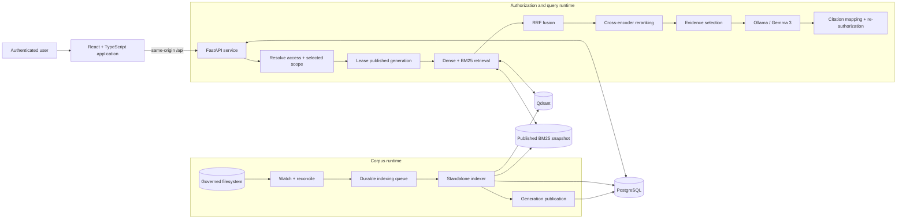

# CIAL Knowledge OS

> An offline-first, on-prem enterprise AI knowledge platform built as part of engineering work at Cochin International Airport—authorization-aware, evidence-grounded, and deployed on local infrastructure.

CIAL Knowledge OS turns governed document repositories into citation-linked answers without sending inference traffic to a hosted model API. It combines authenticated knowledge workflows with a publication-oriented retrieval system designed for changing corpora, per-user access boundaries, and resource-constrained local models.

The current repository is a full-stack engineering and research system, not a claim that enterprise RAG is solved. Phase 4 is implemented but not benchmark-qualified, automated evaluation is heuristic, and offline operation assumes dependencies and model artifacts have already been staged. The [full technical overview](TECHNICAL_OVERVIEW.md) preserves the original README and its detailed implementation notes.

## Visual proof


*A grounded assistant response with linked evidence, explicit evidence gaps, and retrieval/runtime context.*


*The Knowledge Center combines hierarchical corpus navigation, document preview, OCR-backed content, and a document-scoped assistant.*


*Saved Knowledge retains a grounded answer as an inspectable workspace artifact.*

These captures use authenticated local test data. They demonstrate implemented product workflows, not benchmark results.

## What I built

- **Authorization-aware enterprise RAG:** authenticated users query only the organization, department, role, group, ownership, and ACL scope resolved for them; returned sources are re-authorized.
- **Hybrid retrieval and evidence control:** dense BGE-M3 retrieval and BM25 run in parallel, combine through Reciprocal Rank Fusion, pass through cross-encoder reranking, and enter a bounded evidence selector.
- **Citation-linked local answers:** Gemma 3 runs through local Ollama against selected evidence, with document/version/chunk and page, sheet, slide, or anchor provenance retained where extraction provides it.
- **Continuous, incremental indexing:** a standalone worker watches and reconciles repositories, versions changed documents, recognizes moves, reuses compatible chunk embeddings, and publishes verified query generations.
- **Multi-format document intelligence:** PDF, Office, text, structured-data, and image ingestion includes page/sheet/slide-aware extraction, OCR, safe preview paths, and graceful degradation when optional converters are unavailable.
- **Authenticated knowledge workspace:** durable conversations, document analysis, private notes, notebooks, saved answers, summaries, search, previews, and export jobs share server-owned source identities.
- **Evaluation and operations:** frozen benchmark inputs, resumable experiment artifacts, retrieval traces, typed failure states, and an RBAC-protected system monitor make research and runtime behavior inspectable.

## Why it is technically interesting

Enterprise retrieval has to remain correct while files are being edited, moved, deleted, or re-indexed. CIAL Knowledge OS lets an in-flight query lease one immutable published generation while the indexer prepares the next, keeping expensive extraction and embedding work outside interactive request paths.

Authorization is part of retrieval rather than a post-processing filter. Dense and lexical branches receive the same source boundary before ranking, permission identity participates in cache keys, and citations are checked again when returned or opened.

The ranking problem is deliberately staged: semantic and lexical results have incompatible score distributions, so rank fusion combines them before a cross-encoder evaluates query–passage pairs. A separate evidence policy then limits redundancy, source concentration, chunk count, and token use before generation.

Local execution creates a systems constraint as well as a privacy boundary. Embedding, reranking, OCR, indexing, and generation must share finite CPU, RAM, and GPU resources, while reproducible evaluation must retain the exact corpus generation, models, configuration, question order, and failure artifacts.

## Architecture



The interactive path is **browser → React → FastAPI → authorization/query runtime → hybrid retrieval, reranking, and evidence selection → local LLM**. The corpus path is independent: **filesystem → reconciliation and durable jobs → standalone indexer → PostgreSQL/Qdrant/BM25 publication**. PostgreSQL is the metadata and control plane; Qdrant and BM25 are derived retrieval planes.

## Key engineering decisions

- **Authorize before ranking:** disallowed chunks never enter either dense or lexical candidate pools; final sources are checked again.
- **Publish immutable query generations:** a query sees one internally consistent corpus snapshot even while indexing advances.
- **Keep indexing out of request paths:** the standalone worker owns extraction, OCR, embedding, vector writes, lexical publication, leases, and retries.
- **Fuse before reranking:** RRF combines lexical and semantic ranks without pretending their raw scores are comparable; the cross-encoder then supplies joint relevance scores.
- **Select bounded evidence:** threshold, redundancy, diversity, source, count, and token constraints define what generation may consume.
- **Retain provenance under local execution:** versioned source identities survive retrieval, context construction, persistence, citations, preview, and evaluation; models run through the local Ollama stack.

## Technology stack

| Layer | Technologies used |
|---|---|
| Web application | React 19, TypeScript, Vite, TanStack Query, Radix UI |
| API and services | Python 3.11, FastAPI, Pydantic, SQLAlchemy, Alembic |
| Retrieval | BGE-M3 embeddings, BM25, Reciprocal Rank Fusion, `ms-marco-MiniLM-L-6-v2` cross-encoder |
| Local generation | Ollama with `gemma3:12b` |
| Storage and control | PostgreSQL, Qdrant, filesystem-backed source repositories |
| Document processing | PyMuPDF, Docling fallbacks, Tesseract OCR, optional LibreOffice conversion |
| Validation and operations | Pytest, Node test runner, Playwright captures, PowerShell installation and launch tooling |

## Project status

| Classification | Current state |
|---|---|
| **Implemented** | Dense and BM25 retrieval, RRF, cross-encoder reranking, evidence selection, citation mapping, authorization-aware retrieval, local generation, continuous indexing, document versioning, multi-format/OCR ingestion, authenticated workspaces, and operational monitoring are integrated and regression-tested. |
| **Implemented, not benchmark-qualified** | Phase 3 hybrid retrieval and the active Phase 4 reranking/evidence pipeline exist, but this checkout does not contain a retained controlled full-benchmark comparison proving a quality improvement over the frozen baseline. |
| **Experimental or partial** | Phase 4.5 combines implemented engineering work rather than one qualified metric. Several portal-style routes remain static UI prototypes. Historical Phase 5-shaped documentation and compatibility fields remain, but there is no active agentic planner/consensus runtime. |
| **Not currently implemented** | PostgreSQL row-level security, multimodal/vision retrieval, contradiction detection, semantic or entailment-based answer grading, distributed login rate limiting, email/archive/media/CAD ingestion, formal security certification, and a verified cross-platform or CPU-only production path. |

The evaluator reports deterministic keyword, safe-failure, citation, latency, and artifact-integrity proxies. Historical fields named `answer_accuracy` or `hallucination_rate` are not calibrated semantic correctness measures. Security controls are implemented and tested, but no penetration-test, compliance, or certification claim is made.

## Repository map

```text
frontend/                                       React/TypeScript product and UI tests
services/knowledge-engine/backend/              FastAPI API, services, persistence, security
services/knowledge-engine/src/cial_knowledge_os/ Retrieval, reranking, evidence, prompts, evaluation
services/knowledge-engine/backend/app/services/continuous_indexer.py
                                                 Continuous indexing orchestration
services/knowledge-engine/alembic/               PostgreSQL migrations
services/knowledge-engine/scripts/               Evaluation and runtime diagnostics
data/benchmarks/cisg/                            Frozen evaluation benchmark and metadata
docs/architecture/                               System, indexing, data, access, and runtime design
output/playwright/                               Tracked interface verification captures
TECHNICAL_OVERVIEW.md                            Preserved full original README
```

Useful starting points are the [integrated query service](services/knowledge-engine/backend/app/services/knowledge_engine_service.py), [Phase 4 pipeline](services/knowledge-engine/src/cial_knowledge_os/phase4_pipeline.py), [continuous indexer](services/knowledge-engine/backend/app/services/continuous_indexer.py), and [authorization boundary](services/knowledge-engine/backend/app/security/access.py).

## Running locally

The reference deployment is a Windows 11 x64 NVIDIA workstation with local PostgreSQL, Qdrant, Ollama, and the API/indexer/frontend processes. First installation requires network access to stage dependencies and models; “offline-first” describes the inference path after those artifacts are available locally.

```powershell
git clone https://github.com/adithya-a-labs/CIAL-Knowledge-OS-v1-dev.git
Set-Location .\CIAL-Knowledge-OS-v1-dev
.\Install-CIAL-Knowledge-OS.bat
```

Run the installer from an elevated terminal. It validates or installs the reference prerequisites, provisions protected runtime and migration configuration, applies database migrations, validates CUDA and services, and builds the frontend.

For daily use:

```powershell
.\Launch-CIAL-Knowledge-OS.bat
```

The launcher starts or verifies the local dependencies, FastAPI, standalone indexer, and frontend, then opens `http://127.0.0.1:5173/login`. It waits for service readiness and an indexer heartbeat, not for the complete corpus queue to drain. See the [installer guide](docs/WINDOWS_INSTALLER.md) and [manual installation guide](docs/MANUAL_WINDOWS_INSTALLATION.md) for prerequisites, protected configuration, troubleshooting, developer process split, and optional LAN setup.

## Documentation

- [Full technical overview](TECHNICAL_OVERVIEW.md) — the complete original root README, preserved without loss.
- [Full-stack architecture](docs/architecture/FULL_STACK_INTEGRATION.md) — API, frontend, service, and runtime boundaries.
- [Retrieval pipeline and observability](docs/architecture/SEARCH_AND_RETRIEVAL_OBSERVABILITY.md) — retrieval metadata, tracing, and latency surfaces.
- [Indexing and corpus lifecycle](docs/architecture/CONTINUOUS_INDEXING_ARCHITECTURE.md) — durable jobs, versioning, embedding reuse, and publication.
- [Database architecture](docs/architecture/DATABASE_ARCHITECTURE.md) — relational control plane, migrations, and runtime roles.
- [Security and access model](docs/architecture/RBAC_AND_ACCESS_CONTROL.md) — RBAC/ACL policy and its current application-enforced boundary.
- [Automated evaluation](services/knowledge-engine/docs/backend/AUTOMATED_EVALUATION.md) — benchmark mechanics, artifacts, and metric interpretation.
- [Deployment and operations](docs/WINDOWS_INSTALLER.md) — automated Windows installation and daily launch workflow.
- [Runtime configuration](docs/RUNTIME_CONFIGURATION.md) — environment precedence, secrets, repository roots, and deployment policy.
