# CIAL Knowledge OS

> An offline-first, enterprise knowledge operating system that turns governed document repositories into authorization-scoped, evidence-selected, citation-linked answers—on local infrastructure.

**Canonical integrated repository** · **Windows/NVIDIA reference deployment** · **Python 3.11 + FastAPI** · **React 19 + TypeScript** · **PostgreSQL + Qdrant** · **BGE-M3 + cross-encoder + Gemma 3 through Ollama**

CIAL Knowledge OS is a full-stack research and engineering project for a difficult class of retrieval-augmented generation (RAG) systems: assistants that must remain useful over changing enterprise files without treating retrieval, authorization, evidence quality, citations, and operations as separate concerns.

The current system watches governed repositories, versions changed documents, reuses unchanged chunk embeddings, publishes immutable query generations, filters both dense and lexical retrieval before scoring, reranks and selects a bounded evidence set, generates locally, and re-authorizes every returned source. It also provides a durable conversation/workspace layer, multi-format document preview and analysis, and an operator console for the local AI stack.

This README is intentionally precise about status. Phase 4 is **implemented but not benchmark-qualified** on the frozen 200-question benchmark. The evaluation framework is deterministic but heuristic. “Offline-first” describes the deployed inference path after dependencies and model artifacts are staged; first installation and a developer cache miss can still require network access. Security controls are implemented and tested, but no compliance or formal security certification is claimed.

---

## Project at a glance

| Dimension | What exists in this repository |
|---|---|
| Research problem | Grounded enterprise QA under changing corpora, local-model constraints, mixed file formats, and per-user authorization |
| Query path | Deterministic query variants → parallel dense/BM25 retrieval → Reciprocal Rank Fusion (RRF) → cross-encoder reranking → evidence selection → bounded context → local generation → citation repair/linking |
| Data plane | Authoritative source filesystem, PostgreSQL metadata/control plane, Qdrant vector plane, and a published BM25 snapshot derived from PostgreSQL chunks |
| Models | `BAAI/bge-m3` embeddings, `cross-encoder/ms-marco-MiniLM-L-6-v2` reranking, `gemma3:12b` generation through local Ollama |
| Corpus lifecycle | Recursive scanning, SHA-256 change detection, rename/move recognition, immutable versions, leased indexing jobs, chunk-level embedding reuse, verified publication |
| Trust boundary | HttpOnly signed sessions, CSRF and origin checks, organization/department/role/group/ACL policy, retrieval-time filtering, citation-time re-authorization |
| Application | Authenticated assistant, corpus explorer, document workspace, private notes, saved knowledge, summaries, notebooks, export jobs, global search, admin operations monitor |
| Evaluation | Frozen CISG benchmark, experiment grid, resumable Phase 4 runs, CSV/XLSX/JSON/HTML artifacts, local execution traces |
| Reference deployment | Windows 11 workstation, NVIDIA GPU, Docker-hosted PostgreSQL/Qdrant, Ollama, loopback services, optional interface-bound Caddy LAN edge |

### Capability status

The labels below describe what a reader can safely infer from the present code—not what an older roadmap hoped to build.

| Surface | Status | Evidence-backed interpretation |
|---|---|---|
| Phase 1 basic dense RAG | **Implemented baseline** | Preserved configuration, pipeline, notebook, and compatibility contracts |
| Phase 2 query transformation/context construction | **Implemented baseline** | Deterministic variants and bounded context remain active building blocks |
| Phase 3 hybrid retrieval | **Implemented; qualification pending** | Dense and BM25 retrieval, RRF, token-aware context, reports, and traces exist; the full unchanged benchmark comparison is not recorded in this checkout |
| Phase 4 reranking/evidence selection | **Implemented; not benchmark-qualified** | Current API query path uses the Phase 4 pipeline; deterministic tests exist; no benchmark improvement is claimed |
| Phase 4.5 prompt and product hardening | **Integrated engineering** | Versioned prompt registry, adaptive profiles, selected-context enforcement, multi-format/OCR handling, document intelligence, streaming, and product surfaces are wired into the application |
| Phase 5 agentic planning | **Historical/experimental only** | Some documentation, event names, and export-compatibility fields remain, but there is no active Phase 5 planner/consensus implementation in the current source tree |
| Static portal concepts | **Partial UI prototypes** | Analytics, departments, experts, FAQs, learning, graph, gaps, policies, and parts of admin settings still use local data modules; they are not represented here as live backend capabilities |

---

## Why this system exists

Enterprise RAG is often shown as “load documents, create embeddings, ask a model.” That abstraction hides the hard parts:

- Files are renamed, replaced, removed, or edited while users are querying them.
- Dense relevance alone misses exact terminology; lexical relevance alone misses paraphrase.
- The highest-ranked chunk is not necessarily the best evidence set.
- An authorized user may have access to only a narrow slice of a shared index.
- A citation must resolve to the same version and location that supported the answer.
- Local embedding, reranking, and generation models compete for finite CPU, RAM, and VRAM.
- A reproducible research pipeline needs frozen baselines, deterministic artifacts, and honest metrics—not screenshots of one successful answer.

CIAL Knowledge OS treats those as one systems problem. Its central design claim is not that RAG eliminates hallucination. It is that a local assistant can reduce unsupported behavior and improve inspectability when ingestion, publication, retrieval, evidence selection, generation, citations, authorization, and observability share explicit contracts.

### Research questions

1. **Retrieval:** How should dense and lexical signals be combined when their scores are not directly comparable?
2. **Evidence:** Can a smaller, more diverse, less redundant evidence set improve the conditions for grounded generation without pretending that token reduction is answer quality?
3. **Freshness:** How can a live corpus change continuously while every query sees one internally consistent generation?
4. **Authorization:** Where must access control be applied so disallowed content never becomes a retrieval candidate, cached result, or citation?
5. **Local systems:** How should embedding, reranking, and generation share a single workstation without silent CPU fallback or unstable latency?
6. **Evaluation:** Which claims can deterministic offline measures support, and which still require a controlled real-model benchmark or human review?

### Principal contributions

- A **publication-oriented RAG runtime**: background indexing can advance while in-flight queries retain an immutable published snapshot.
- An **authorization-first hybrid retriever**: Qdrant and BM25 receive the same resolved source boundary before ranking; a permission-scoped cache cannot cross users or policy graphs.
- A **two-stage context funnel**: broad hybrid candidates are cross-encoded, then filtered for relevance, diversity, redundancy, count, and token budget before final context construction.
- A **durable incremental corpus engine**: file and folder moves are distinguished from content changes; chunk hashes allow safe embedding reuse only when model and chunking contracts match.
- A **provenance-preserving application layer**: conversations, answer evidence snapshots, citations, notes, summaries, notebooks, previews, and exports retain server-side identities rather than trusting client-supplied content.
- A **scientifically cautious evaluation stack**: frozen benchmark inputs, configuration fingerprints, per-question failure isolation, resume checkpoints, and self-contained reports—without relabeling keyword heuristics as semantic truth.

---

## System architecture

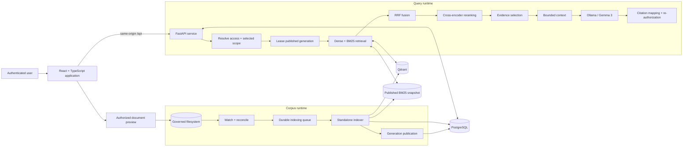

The API does not scan or embed the corpus during ordinary startup. A standalone indexer owns extraction, embedding, vector writes, lexical snapshot creation, and publication. This separation keeps user requests away from expensive mutation work and makes queue state, worker leases, and generation identity explicit.

### Application layering and dependency direction

The main architecture diagram shows runtime topology; the diagram below shows the software dependency direction inside the integrated repository. FastAPI's composition root constructs shared services and places them on application state. Most domain routes validate transport contracts and delegate to services. Chat is the deliberate exception: its route also coordinates streaming, request/session identity, and cancellation, while retrieval, reranking, evidence selection, generation, and citation behavior remain in the reusable knowledge-engine package.

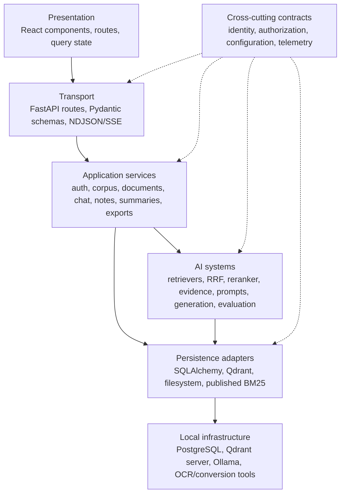

Dependencies point inward from delivery mechanisms toward domain and AI behavior; storage and model runtimes are reached through explicit adapters. This is not a claim of strict clean-architecture purity—the integrated chat route and application state are pragmatic composition boundaries—but it prevents React, database sessions, vector clients, and model adapters from collapsing into one undifferentiated pipeline.

### Software boundaries

| Layer | Responsibilities | Deliberate exclusions |
|---|---|---|
| React client | Authentication state, server-state caching, NDJSON/SSE consumption, corpus and workspace interactions, accessible previews | Does not receive database/vector credentials; does not decide authorization |
| FastAPI application | HTTP validation, authentication, authorization, chat/session persistence, query orchestration, preview/export services, operational projections | Does not perform background corpus embedding at startup |
| Knowledge engine package | Retrieval, fusion, reranking, evidence selection, token/context management, prompts, generation adapters, citations, evaluation/reporting | Does not own browser identity or database policy decisions |
| Standalone indexer | Scan/reconcile, extraction/OCR, chunking, embedding reuse, Qdrant writes, BM25 publication, worker telemetry | Does not serve chat requests |
| PostgreSQL | Identity/policy graph, corpus metadata, immutable versions/chunks, queues/leases/generations, conversations and workspace artifacts | Does not store original enterprise files or vector embeddings |
| Qdrant | Verified vectors plus indexed authorization/provenance payload | Does not replace PostgreSQL lifecycle truth |
| Filesystem | Authoritative original enterprise and managed personal files | Is never exposed as an arbitrary path API |

The backend currently has one linear Alembic history of 20 revisions, ending at `20260811_0020`. It evolved from metadata foundations through access control, local auth, repository scoping, private workspaces, notes/summaries, analysis artifacts, continuous indexing, incremental chunk reuse, deterministic chat ordering, notebooks, and session revocation.

### API domain map

The backend exposes 16 router modules under the same `/api` boundary. Sixty-eight operations declare explicit Pydantic response models; long-running chat and summary responses use newline-delimited JSON, while the authenticated admin monitor uses server-sent events.

| Domain | Representative responsibility | Service boundary / persistence consequence |
|---|---|---|
| Health and administration | Liveness, bounded dependency probes, live system events | Public health is minimal; detailed state is permission-protected and content-minimized |
| Authentication | Signup/login/logout/current user, signed session and CSRF cookies | Credential and session-version state lives in PostgreSQL; browser code never receives the signing secret |
| Corpus and documents | Browse, upload, metadata, source file, preview, thumbnail, rendering | Source identities are authorized before file resolution; uploads create durable metadata/indexing work |
| Chat | Sessions, messages, attachments, grounded streaming, feedback | Durable turn order and evidence snapshots are retained independently of stream completion order |
| Indexing and settings | Queue/status controls, repository/runtime settings | API requests enqueue or project work; the standalone worker performs expensive mutation |
| Workspaces, notebooks, notes | Private knowledge organization and versioned authored content | Ownership is enforced server-side; notes can become separately versioned/indexed assets |
| Search and saved knowledge | Authorized cross-surface search, retained grounded answers | Search history and saved artifacts reference server-owned source and answer identities |
| Summaries and evaluation | Version-pinned document analysis and controlled experiment execution | Summary jobs retain source fingerprints/citations; evaluation outputs are separated from product claims |
| Exports | Asynchronous PDF/DOCX generation and expiry | Jobs snapshot authorized server-side content and reject stale source hashes |

The schemas are transport contracts, not duplicate domain models. Route handlers translate HTTP concerns into service calls; SQLAlchemy models and knowledge-engine dataclasses remain authoritative for persistence and pipeline state. Errors are intentionally typed at important boundaries—such as unavailable runtime reasons, stale exports, unsafe paths, and invalid scope—but the repository does not yet impose one universal error envelope across every route.

### PostgreSQL as the control plane

PostgreSQL coordinates the parts of the system that must remain consistent across API, indexer, and future process restarts:

| Model family | Examples | Integrity mechanism |
|---|---|---|
| Identity and policy | organizations, departments, users, credentials, roles, permissions, groups and memberships | Foreign keys, scoped uniqueness, role/permission joins, session-version revocation |
| Knowledge lifecycle | workspaces, folders, documents, immutable document versions, chunks, relationships and search metadata | Repository/path uniqueness, lifecycle/status checks, current-version identity, content hashes |
| Durable operations | ingestion runs, indexing jobs, worker heartbeat, index generations, exports | Status/operation constraints, claim-order and lease-recovery indexes, retry availability, single publication pointer |
| Conversation provenance | sessions, messages, saved contexts, feedback, summaries | Stable session/message identities, deterministic turn ordering, persisted evidence/config snapshots |
| Personal knowledge | notes and versions, notebooks and sources, saved knowledge, summary artifacts/citations/map results | Owner-scoped indexes, revision uniqueness, one-target constraints, private/restricted visibility checks |
| Audit and measurement | audit events, retrieval events, search history | Actor/entity indexes, normalized-query uniqueness, safe structured metadata |

Indexes follow actual access paths rather than indexing every column: owner-plus-recency for personal content, repository/path and content hash for corpus reconciliation, status-plus-availability for workers, and partial unique indexes that prevent two active jobs for the same document or note version and operation. Alembic is the only supported schema-evolution path. Runtime credentials and migration credentials are separate because ordinary request/indexer roles should not require schema-changing authority.

### System invariants

The implementation repeatedly enforces a small set of cross-layer rules:

1. **Authorization precedes ranking.** Dense and lexical candidates are filtered to the same resolved source boundary before scoring; citations and attached sources are re-authorized on return.
2. **A query reads one published generation.** It may complete against generation *N* while *N+1* is built, but it does not observe a half-published mix.
3. **Original bytes, metadata, and embeddings have different authorities.** Filesystem, PostgreSQL, Qdrant, and BM25 publication artifacts are not interchangeable.
4. **Content change creates version identity.** Reuse requires matching content/chunk hashes plus the embedding and chunking contract; a path-only move updates provenance without pretending bytes changed.
5. **The API does not become an indexer.** Startup checks query readiness, and request paths durably enqueue work instead of performing corpus-wide extraction or embedding.
6. **Personal artifacts remain owner-scoped by default.** Notebook visibility is database-constrained to private; saved knowledge permits only private or restricted visibility.
7. **Unsupported evidence does not become confident prose.** Weak evidence, unsupported scope, and generation failure remain distinct outcomes.
8. **Benchmark targets are immutable.** A correction or extension creates a new benchmark version; it does not silently edit the baseline used for prior comparisons.

---

## Research evolution: from notebook baseline to integrated system

The repository preserves phase isolation so later work can be compared with earlier contracts. “Later” does not automatically mean “better”; an improvement requires a controlled comparison on the same corpus, questions, models, and effective configuration.

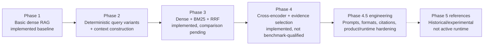

### Phase 1 — dense retrieval baseline

The initial baseline established local document loading, chunking, BGE-M3 embeddings, persistent Qdrant storage, local Ollama generation, and citations. Its value is methodological: it remains a simpler comparison point rather than being rewritten to look like the current architecture.

### Phase 2 — deterministic query and context work

Phase 2 added inspectable query variants—original, rewritten, keyword-expanded, and domain-reformulated—without an LLM rewrite dependency. It also centralized context construction and budget reporting. Deterministic transformations make experiment artifacts explainable and reduce one source of run-to-run variance.

### Phase 3 — hybrid retrieval

Phase 3 introduced a common dense/BM25 retriever interface and proper Reciprocal Rank Fusion. RRF combines ranks rather than averaging incompatible cosine, BM25, and later cross-encoder scores. Dense and lexical work can execute concurrently under independent time bounds; a surviving authorized branch can still produce a bounded result if the other times out.

The implementation and offline tests exist. A full, retained Phase 2-versus-Phase 3 real-model run on the frozen benchmark is not present, so this repository does not claim measured superiority.

### Phase 4 — reranking and evidence selection

Phase 4 reranks the fused candidate pool with a cross-encoder, then applies an explicit selection policy. Default controls include a 30-candidate reranking depth, up to eight selected chunks, an evidence target of 800–1,500 tokens within a 2,400-token ceiling, no more than two chunks per source, and lexical redundancy suppression. Configuration remains authoritative; these defaults are not universal optimums.

The pipeline distinguishes `answered`, `insufficient_evidence`, `unsupported_query`, and `generation_failed`. Weak or empty evidence fails closed by default rather than silently turning the language model into an outside-knowledge answerer.

### Phase 4.5 — integrated engineering, not a single metric

The “4.5” work is distributed across the system: versioned adaptive prompts, response profiles, multi-format and OCR support, selected-context scoping, source/page/chunk links, document analysis, streaming, concurrency, continuous indexing, GPU coordination, authentication, and product integration. It is best understood as the transition from a research pipeline to an operable local knowledge system.

### Phase 5 — what is not claimed

Current source retains some Phase 5-shaped export fields and observability event names, while older documentation describes an optional agentic planner. The active package no longer contains that planner/agent/consensus implementation. Accordingly, Phase 5 is treated here as historical/experimental lineage, not a shipped capability.

### From research concept to engineered subsystem

The integrated application did not merely wrap a notebook with an API. Each research idea acquired operational contracts that make it testable under concurrency, authorization, failure, and corpus change:

| Research concept | Engineered subsystem | Contract that makes the concept operational |
|---|---|---|
| Dense retrieval baseline | Embedding adapter, Qdrant collection contract, indexed provenance payload | Model identity/dimension, source authorization fields, version and generation identity are validated |
| Deterministic query expansion | Reusable query transformer and traceable variant set | Original and derived variants remain inspectable and cannot widen the user's authorized scope |
| Hybrid retrieval | Concurrent dense/BM25 branches plus RRF | Common candidate identity/provenance, independent time bounds, rank-based fusion rather than score mixing |
| Cross-encoder reranking | Lazy local reranker with bounded batches/cache-first loading | Reranking receives only fused authorized candidates and reports the effective device/model |
| Evidence selection | Explicit token/count/source/diversity funnel | Final context is smaller than the candidate pool, deterministic under fixed inputs, and independently observable |
| Grounded generation | Versioned prompts, answer profiles, local streaming adapter | The prompt consumes selected evidence only and exposes safe insufficient-evidence/generation-failure states |
| Citations | Stable evidence IDs, source-coordinate metadata, authorized preview routes | A citation resolves to the retained document version/chunk and is authorized again when opened |
| Comparative evaluation | Frozen benchmark, grid runner, checkpoint/resume, self-contained reports | Effective configuration and ordered-question identity travel with results; proxies are not overstated as truth |

This bridge matters scientifically: a measured retrieval technique is reproducible only when the surrounding source identity, effective configuration, and failure policy are controlled. It also matters operationally: a production-safe subsystem can be implemented and regression-tested without claiming that it has already improved answer quality.

---

## End-to-end query pipeline

The browser streams a typed chat request to `/api/chat/stream`. The API resolves the authenticated principal, persists conversation order, enforces bounded global/per-user capacity, and passes a request-local configuration and access scope to the knowledge engine.

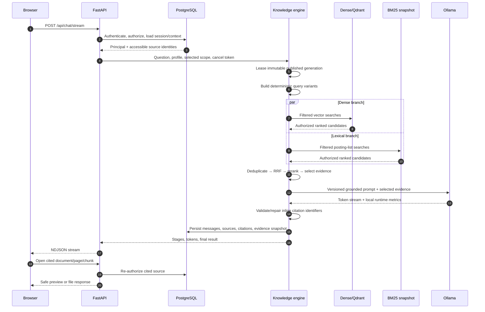

### 1. Scope is resolved before retrieval

Authorization derives from the authenticated user’s organization, departments, roles, permissions, groups, ownership, and explicit workspace/folder/document ACL grants. Enterprise visibility rules and personal ownership are applied in SQL. Selected documents, folders, and notes narrow that already-authorized universe; they never expand it.

Resolved relative paths, current document-version IDs, and current note revisions are sent into both retrieval branches. Qdrant applies payload filters before returning vectors. BM25 selects only indexes belonging to the same published and authorized scope before scoring. Candidate limits are bounded even for large scopes.

### 2. Query variants broaden language, not authority

The query transformer emits up to four deterministic views. Retrieval runs over the same access and publication boundary for each view, and merged results are deduplicated. Query transformation cannot add a source to the authorized set.

### 3. Hybrid retrieval preserves provenance

Dense and lexical results retain modality rank and raw score. RRF uses the standard rank contribution `weight / (k + rank)` (default `k = 60`), avoiding the false precision of normalizing unrelated score distributions. Retrieval caches include normalized query identity, published generation, workspace/search scope, and a fingerprint of the effective permission boundary.

### 4. Reranking happens before evidence selection

The cross-encoder jointly scores the query and each fused candidate. It is lazy-loaded, cache-first, batched, and time-bounded. Developer mode may stage a missing model once; UAT/production configuration requires local-only/offline model resolution.

### 5. Evidence selection is an explicit funnel

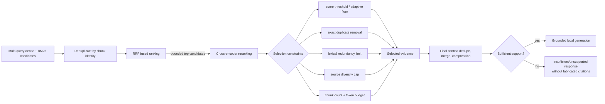

Selection records both kept and discarded chunks with normalized reasons such as threshold failure, redundancy, source concentration, token budget, empty text, or lower-rank fallback. The final context builder can deduplicate, merge overlaps, compress, and fit the model budget; Phase 4 disables neighbor expansion by default so an unselected neighbor does not bypass reranking.

### 6. Generation is local and profile-aware

The active generation prompt is `generation.phase4_system`. The prompt registry validates declared variables strictly and versions generation, summarization, evaluation, and context templates. `quick`, `standard`, `detailed`, `operational`, and `elite` profiles change answer-depth instructions—not the evidence boundary. Operational and elite preserve no default maximum word cap; a request-level cap is validated to a bounded range.

Ollama generation defaults to `gemma3:12b`, temperature `0`, `num_gpu=-1`, a 30-minute keep-alive, a bounded request timeout, and retry/cooldown only for classified transient failures. These are deployment defaults, not evidence of model quality.

### 7. Citations are derived from final evidence

Citations are mapped from the final compressed context, assigned stable reference IDs, and enriched with document/version/chunk plus page, sheet, slide, or anchor metadata where the loader provides it. Invalid inline citation numbers are replaced with an unavailable marker rather than linked to an unrelated source. The API re-authorizes returned sources, and a later citation click passes through the ordinary authorized document route again.

---

## Corpus, storage, and publication

### Three stores, three authorities

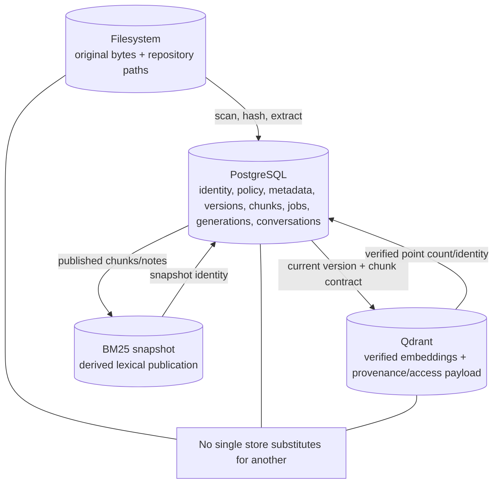

- **Filesystem:** authoritative for original enterprise documents and managed personal files. Enterprise files are indexed in place rather than copied into the application checkout.
- **PostgreSQL:** authoritative for identities, policy inputs, repository/folder/document metadata, immutable versions, extracted chunk records, lifecycle state, durable work, publication pointers, chats, notes, summaries, notebooks, search history, and export jobs.
- **Qdrant:** authoritative for the verified vector representation of a published version. Its payload carries the provenance and access fields needed for pre-scoring filters.
- **BM25 snapshot:** a replaceable publication artifact built from PostgreSQL chunk/note records. It is not a fourth source of business truth.

PostgreSQL authorization is application-enforced; database row-level security is not implemented. ACL records are grants over a deny-by-default baseline—this README does not claim an explicit “deny overrides allow” model that is absent from the code.

### Continuous incremental indexing

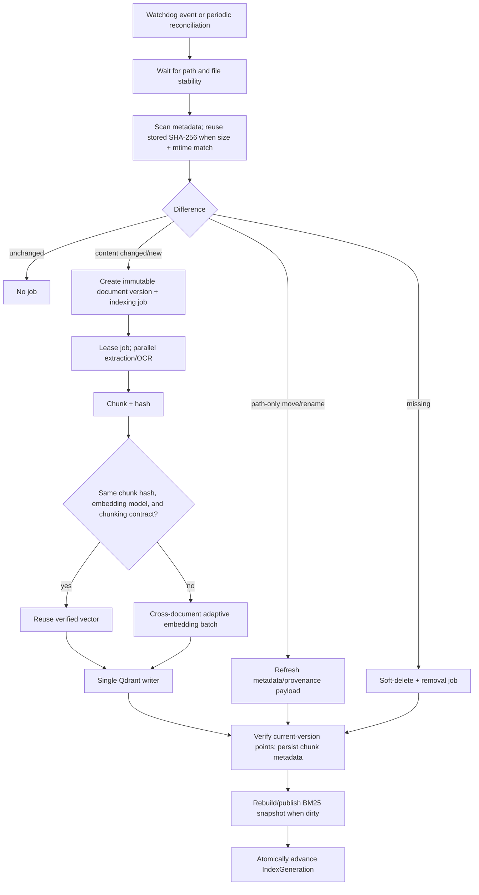

The scanner recognizes content-preserving moves by hashes and sizes. A path-only move still schedules metadata work because paths participate in citations and authorization payloads, but it does not need to re-extract or re-embed the bytes.

Indexing jobs are durable PostgreSQL records with leasing, heartbeat, retry, availability, and stale-worker recovery. CPU extraction and OCR are separate bounded pools. Prepared chunks enter cross-document embedding batches as they become ready; batches are constrained by item count, token count, and wait time and can shrink recursively on memory pressure. One writer serializes Qdrant mutations.

Before a version is marked indexed, the worker verifies that it is still current and that its vector payload satisfies the authorization/provenance contract. If a newer version won the race, only the obsolete points are cleaned. BM25 publication is derived after durable chunk state exists; queries never rebuild an authorization-specific lexical model on their critical path.

The publication pointer lets an active request finish against generation *N* while the indexer prepares and atomically exposes generation *N+1*. Query startup refreshes published identities, but it does not scan, chunk, embed, or mutate the corpus.

### Synchronization, indexing, and document lifecycle

Corpus synchronization and indexing are separate transactions. The watcher debounces filesystem events and waits for file stability; the scanner builds a path/hash snapshot; the synchronizer reconciles that snapshot into PostgreSQL document/version records and durable jobs. Only the standalone worker claims those jobs and mutates derived retrieval state. Periodic reconciliation remains necessary because filesystem watchers are hints, not an authoritative event log.

| Lifecycle transition | PostgreSQL effect | Derived-state effect |
|---|---|---|
| New file or changed content | Create/update document identity, append immutable `DocumentVersion`, set current version, enqueue `upsert_version` | Extract, chunk, embed/reuse eligible chunks, write Qdrant, rebuild BM25 when dirty, publish generation |
| Unchanged size/mtime/hash | Refresh scan facts where needed; create no content job | Preserve current vectors and lexical publication |
| Path-only move/rename | Update folder/path provenance and enqueue metadata refresh | Rewrite citation/access payload as needed; avoid re-extraction and re-embedding |
| Missing enterprise file | Soft-delete lifecycle record and enqueue `delete_asset` | Remove obsolete vector/lexical entries before publication |
| Retry after transient failure | Revalidate current bytes/hash, create a new version if bytes changed, schedule availability with bounded attempts | Resume from a durable job, never trust a stale artifact merely because a retry was requested |

The indexing queue has explicit pending, claimed, extraction, chunking, embedding, writing, verification, retry-wait, completed, failed, superseded, and cancelled states. Claims carry worker identity, heartbeat, and lease expiry; a stale lease can be recovered after a worker dies. Active-job partial unique indexes prevent duplicate work for the same document/note version and operation. Before completion, the worker checks that the indexed version is still current and verifies required Qdrant payload fields. Publication follows durable verification, not the earlier moment when extraction happened to finish.

Preview lifecycle is intentionally derived and bounded. A preview resolves an already-authorized document below an allowed root, then chooses a type-specific reader or an optional Office-to-PDF rendering path. Preview and thumbnail cache keys include document identity and content hash, so a changed version cannot silently reuse the prior representation. Cache writes use a temporary file followed by replacement. HTML/Markdown paths are sanitized and active content is sandboxed or downloaded; unsupported conversion produces a limited state rather than bypassing the original-file authorization route.

### Supported document intelligence

Current ingestion-enabled formats are:

| Family | Extensions | Primary behavior |
|---|---|---|
| PDF | `.pdf` | PyMuPDF page-aware extraction; Docling fallback when required |
| Word | `.docx`, `.doc` | Native/Docling extraction; optional LibreOffice PDF preview conversion |
| Spreadsheet | `.xlsx`, `.xls`, `.csv` | Sheet-aware extraction and bounded table preview |
| Presentation | `.pptx`, `.ppt` | Slide-aware extraction where supported; optional LibreOffice rendering |
| Text/web/data | `.txt`, `.md`, `.markdown`, `.html`, `.htm`, `.json`, `.xml`, `.yaml`, `.yml` | Local parsers with safe text/HTML preview paths |
| Images | `.png`, `.jpg`, `.jpeg`, `.tiff`, `.tif` | Tesseract OCR plus image preview |

Legacy Office support can depend on the available Docling/LibreOffice backend. Email containers, archives, arbitrary source-code/devops formats, multimedia, and CAD are recognized in the format registry as future categories but are **not active ingestion formats**. Visual document understanding and multimodal retrieval are not implemented; image support is OCR, not vision-language inference.

Preview responses resolve sources below configured roots, are authorization-checked, and use private/no-store, no-sniff, referrer, content-disposition, and sandbox/CSP controls appropriate to the content. Markdown and HTML are sanitized. PDF.js/react-pdf supports page navigation; spreadsheet, slide, image, text, and safe-HTML renderers retain the most useful source coordinate available. When an Office-to-PDF converter is unavailable, the UI exposes a limited preview/open-original state rather than pretending conversion succeeded.

---

## Models and local compute

| Role | Default | Why it is here | Runtime behavior |
|---|---|---|---|
| Embeddings | `BAAI/bge-m3` | Multilingual dense retrieval with one reusable embedding interface | Output dimension is derived from the loaded model; document embedding is batched by the indexer, query embedding defaults to CPU |
| Reranker | `cross-encoder/ms-marco-MiniLM-L-6-v2` | Joint query-passage relevance after hybrid fusion | Lazy, batch size 16, device `auto`, cache-first; local-only required in hardened environments |
| Generator | `gemma3:12b` via Ollama | Local grounded synthesis without a hosted inference API | Temperature 0, bounded streaming, retries for transient local failures, GPU/CPU/hybrid state observed from Ollama rather than guessed |

The indexer’s device is `auto` by default and its preferred precision is FP16. CPU resolution changes effective precision to FP32 with an explicit diagnostic. An explicitly requested CUDA device that cannot be used is an error; the system does not silently certify GPU execution from configuration alone.

Embedding and generation are coordinated because both may want most of the same VRAM. A cross-process chat-priority marker lets the indexer pause or move the embedding model away from CUDA; it can release a warm Ollama model before a large embedding interval and later rewarm as work returns. The operator view reports configured device, resolved model device, memory, utilization, load source, queue state, and measured timing boundaries. Ollama does not expose a trustworthy layer count here, so the telemetry deliberately leaves it null instead of fabricating a value.

### Concurrency and resource controls

Concurrency is bounded at the scarce resource, not only at the HTTP worker:

| Boundary | Control | Failure/ordering property |
|---|---|---|
| Chat admission | Global and per-user active/queued limits with fair scheduling and queue-wait timeout | One user cannot consume every slot; overload becomes an explicit admission/timeout result |
| Per-session persistence | Request IDs, reserved turn order, message-scoped cancellation | Streams may complete out of order while durable conversation order remains deterministic |
| Query stages | Separate gates for query embedding, retrieval, reranking, and generation | A large executor cannot accidentally create unbounded model concurrency |
| Dense and lexical retrieval | Concurrent branches with independent timeouts | One surviving authorized branch may produce a bounded degraded result; scope cannot widen during fallback |
| Index extraction/OCR | Separate bounded CPU pools | Slow OCR does not monopolize every extraction worker |
| Embedding | Cross-document adaptive batches bounded by item count, token count, and wait time | Batches shrink recursively on memory pressure instead of assuming fixed GPU capacity |
| Vector writes | Single serialized Qdrant writer | Concurrent preparation cannot race publication mutations |
| Chat versus indexing GPU use | Cross-process priority marker, model offload/release/rewarm policy | Interactive generation can take precedence without claiming that configured CUDA equals observed residency |

The default local generator is effectively serialized even though the application can admit and retrieve multiple requests. This is a deliberate capacity constraint for one Ollama/model runtime, not a claim that the whole query pipeline is single-threaded.

### Configuration as a runtime contract

Python entry points share one non-evaluating environment loader. It reads repository, service, and backend `.env` files from lower to higher priority, optionally appends an explicitly named runtime file, and preserves variables already set by the calling process. Values are parsed as literal assignments—no shell expansion or command execution. Required-key errors list key names without printing values.

Repository selection has a separate application-config layer: explicit corpus environment variables take precedence over saved repository configuration, with a legacy data-directory fallback. Conflicting environment and saved corpus roots cause startup refusal in UAT/production. Candidate roots are checked against allowed roots and protected application, workspace, model, output, home, configuration, and system locations before being saved.

Configuration affects scientific reproducibility as well as deployment. Retrieval depths, timeouts, model identities, devices, batching, token budgets, prompt profile, and fallback policy can change an answer while source code remains constant. Evaluation fingerprints therefore retain effective values; runtime status distinguishes requested from resolved device/model state. Browser-visible `VITE_*` configuration is treated separately from server credentials, and migrations use a dedicated database identity.

---

## Prompt architecture

Prompts are package assets under `services/knowledge-engine/src/cial_knowledge_os/prompts/`, addressed by logical names in a YAML registry. `PromptManager` loads, caches, validates required variables, rejects unexpected/missing inputs, and renders an immutable template version. The active answer shell requires selected evidence only, exact inline reference identifiers, partial-answer disclosure, and a deterministic insufficient-evidence response.

Answer profiles control structure and depth:

| Profile | Default minimum | Default maximum | Intended use |
|---|---:|---:|---|
| Quick | 120 words | 250 words | Short grounded response |
| Standard | 250 | 700 | Normal detailed answer |
| Detailed | 350 | 2,000 | Broader synthesis |
| Operational | 350 | None | Decision-support depth constrained by evidence/model budget |
| Elite | 350 | None | Same uncapped prompt family with explicit high-detail intent |

Word targets never authorize unsupported padding. Adaptive sections select only relevant families—such as findings, risks, procedures, comparison, actions, dependencies, evidence gaps, and caveats—and may be disabled for a reproducible fixed structure.

One important repository lesson came from a prompt-quality regression investigation: the prompt text had not regressed. The observed drift came from orchestration—API profile caps, selected context not reaching generation, and hidden effective metadata. The fix added canonical profiles, validated request caps, selected-context propagation, guarded debug metadata, and later moved selected-context enforcement into pre-retrieval dense/BM25 filters. This is why the project treats the rendered prompt, effective configuration, retrieved scope, selected evidence, and final citations as one traceable contract.

---

## Evaluation and scientific integrity

### Frozen benchmark

`data/benchmarks/cisg/benchmark_metadata.json` identifies `cisg_benchmark_v1`, version `1.0.0`, status `frozen`, with 200 questions: factual, definition, procedure, comparison, executive-summary, enterprise, cross-document, and unsupported. It records ground-truth generation with Claude followed by manual review and disallows outside knowledge. Those metadata are provenance, not an independent guarantee that every reference answer is correct.

The benchmark is immutable for cross-phase comparison. Corrections or extensions require a new version rather than silently changing the target after an experiment.

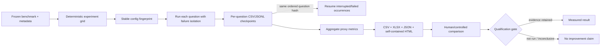

### What the automated metrics mean

The evaluator checks expected-keyword coverage, forbidden keywords, supported-versus-unsupported behavior, safe failure, citation presence/completeness, latency, and artifact integrity. Fields named `answer_accuracy` and `hallucination_rate` are historical schema names for these deterministic proxies. They are **not** semantic entailment, calibrated factuality, or a general hallucination measure.

The framework does not currently provide labeled-chunk retrieval recall, contradiction detection, semantic answer equivalence, model-judged correctness, or expert adjudication. A model implementation, a passing unit test, and a measured benchmark improvement are three different claims.

### Reproducibility mechanics

- Experiment grids use deterministic Cartesian products and stable fingerprints.
- Failures are isolated per question so a long run still produces inspectable output.
- Phase 4 checkpoints persist partial result CSV, result/retrieval JSONL, and atomic checkpoint state after each attempt.
- Resume validates the exact ordered question identity hash; duplicate question text does not collapse occurrences.
- Final run bundles retain effective configuration, summaries, retrieval traces, metrics, logs, context artifacts, figures, and self-contained reports.
- The execution/observability package emits typed local events to isolated subscribers and writes `execution_trace.jsonl`, `progress.json`, and `progress.log`; it does not control retrieval or generation.

No expensive real-model benchmark was run as part of this README audit. Therefore this document makes no Phase 3 or Phase 4 quality delta claim.

---

## Security and trust boundaries

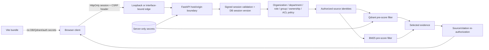

### Implemented controls

- Local email/password credentials use scrypt with random salts.
- Session tokens use a fixed validated header and HMAC-SHA256 signature, include issued/expiry/version claims, and are compared in constant time.
- Logout advances a database session version so a copied older token cannot be accepted merely because its signature remains valid.
- Cookies are HttpOnly with configurable Secure/SameSite attributes. Unsafe methods require a signed double-submit CSRF value and origin/site validation.
- Login/signup have bounded in-process rate limits. This is not presented as a distributed gateway limiter.
- UAT/production configuration fails closed for short auth secrets, non-offline model policy, or missing Qdrant API key in server mode.
- Test identity headers are restricted to the test environment and loopback; they are not an alternate LAN authentication mode.
- Path resolution rejects escapes and unsafe repository roots/names; active content is served as sandboxed/attachment content rather than executed.
- Retrieval and retrieval caches are permission-scoped; returned citations and attached notebook sources are re-authorized.
- Server environment files are parsed as literal `KEY=VALUE` data without shell evaluation. Protected runtime secrets are separated from migration credentials and are not injected into Vite.

### Important limitations

- Authorization is enforced by application queries and vector/lexical filters, not PostgreSQL row-level security.
- The process-local auth limiter does not coordinate multiple API replicas.
- Optional Windows hotspot mode is a connectivity boundary, not a trust boundary; every client still authenticates. HTTP is a development option, while protected deployments require configured HTTPS and client trust for the local CA.
- No penetration test, compliance audit, formal threat model sign-off, or security certification is claimed.
- Generated answers can still be incomplete or wrong. The UI deliberately asks users to verify critical information against cited sources.

---

## Product and human-computer interaction

The product surfaces are designed around evidence inspection rather than a single chat box:

- **Assistant:** multi-request NDJSON streaming, per-request cancellation, selected documents/folders/notes, response profiles, grouped sources, message feedback/transformation, durable history, and export jobs.
- **Knowledge Center:** live corpus tree, search, upload/retry status, document preview, analysis, and contextual handoff to the assistant.
- **My Workspace:** private managed files, revision-safe notes, tags and document links, saved grounded answers, summaries, and activity.
- **Notebook workspaces:** owner-private collections of authorized document/note/summary references, a hard-scoped assistant, notes, generated artifacts, and reused document preview/export surfaces.
- **Global search:** authorization-first federated search across documents, passages, notes, conversations, summaries, and actions.
- **Admin operations monitor:** RBAC-protected live snapshot/SSE view of database, Qdrant, published generation, queues, indexer heartbeat, model state, GPU, query stages, and optional LAN edge.

Several portal-style routes remain static prototypes. Their presence is useful for product exploration, but static analytics, expert, learning, organizational, policy, graph, and gap data are not evidence of corresponding backend intelligence.

### Current verified interface captures

These tracked screenshots were produced against authenticated local test data. They illustrate behavior; they are not benchmark results.

**Grounded assistant answer with inline citations, evidence gaps, grouped source metadata, profile/runtime details, and background-index status**

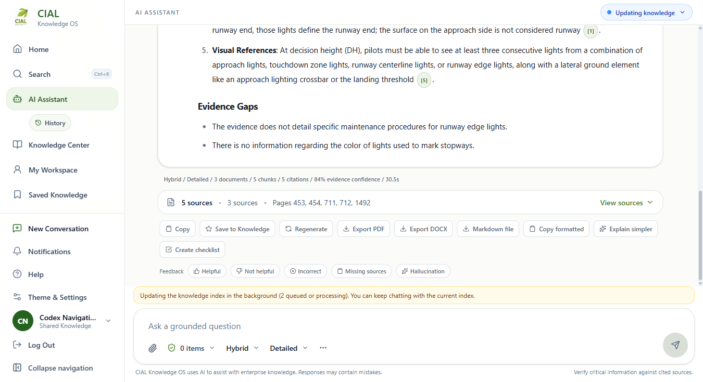

**Knowledge Center document workspace with hierarchical corpus navigation, OCR image preview, and a document-scoped assistant**

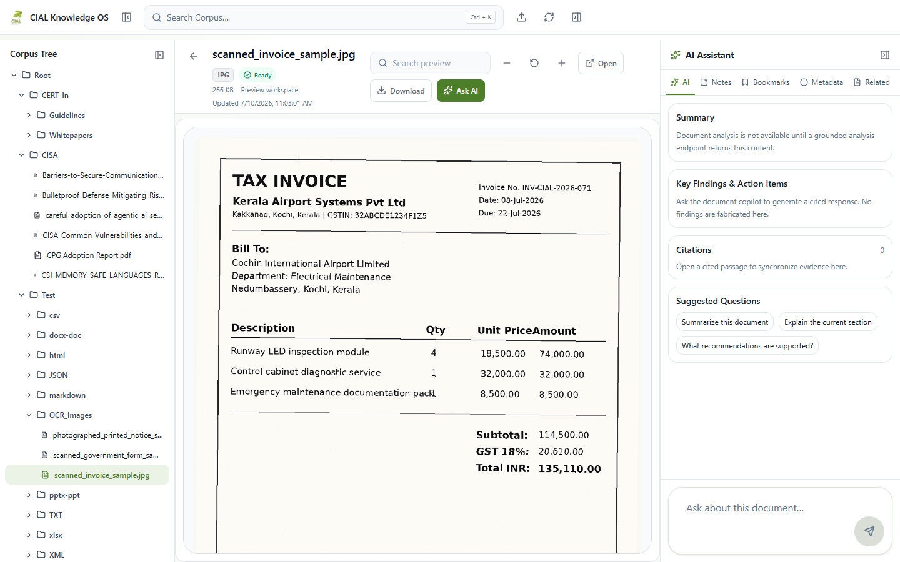

**Saved Knowledge preserving a cited answer as a durable, inspectable workspace artifact**

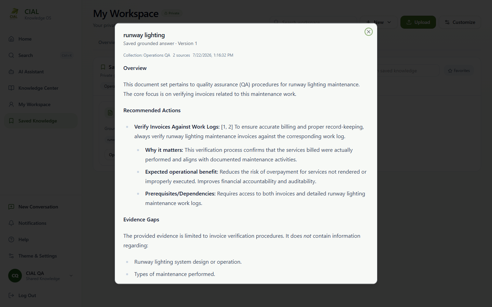

The frontend uses stable server-state query keys, typed API adapters, protected routes, semantic status/error states, keyboard-aware navigation, targeted motion, and reduced-motion behavior. Responsive document and notebook panels keep one contextual modal owner so mobile drawers, previews, and assistant sheets do not stack incompatible focus/scroll locks.

---

## Selected engineering investigations

The repository history includes several useful examples where the visible symptom was not the actual fault boundary.

| Investigation | Observed symptom | Root cause found | Engineering response | General lesson |
|---|---|---|---|---|
| Prompt quality drift | Current UI answers felt shorter or less targeted than the earlier Phase 4.5 workflow | Prompt templates were unchanged; API profile caps, ignored selected context, and hidden effective metadata created orchestration drift | Canonical profiles, validated request caps, selected-context wiring, guarded trace metadata, and later pre-retrieval filters with regression tests | Audit effective pipeline state before rewriting a prompt |
| BM25/query latency | A previously unseen authorization scope could produce large lexical latency | Query-time construction of a new authorization-specific BM25 model retokenized broad corpora | Publish posting structures once, map authorized paths to immutable chunk indexes, cache only bounded index arrays, and prohibit query-time BM25 rebuilds under the managed contract | Move repeatable work to publication; keep authorization in selection, not reconstruction |
| GPU truthfulness | Configuration said CUDA while work could be CPU, hybrid, idle, or in another process | Requested device, resolved device, model residency, and utilization were conflated | Validate the model’s actual device, fail explicit CUDA requests when unavailable, coordinate chat/indexing residency, sample NVIDIA/Ollama telemetry, leave unknown layer count null | Telemetry must report observed state, not desired state |
| Runtime/secret propagation | Fresh shells and multiple scripts could disagree on Qdrant/database/model configuration; browser builds risked inheriting server variables | Environment loading and migration/runtime identity had overlapping responsibilities | Shared non-evaluating loaders, explicit precedence, protected server files, separate migration credentials, server-only Vite guard tests | Configuration is a security boundary and a reproducibility input |
| Concurrent chat ordering | Multiple streams could complete out of order or share mutable pipeline diagnostics | Completion order, request order, and singleton mutable state were coupled | Request IDs, durable turn order, per-request pipeline/config copies, bounded fair queues, resource gates, and message-scoped cancellation | Concurrency requires isolating identity and mutable diagnostics, not merely adding threads |

These investigations are documented across [`docs/PHASE_4_5_TO_DEV_PROMPT_REGRESSION_AUDIT.md`](docs/PHASE_4_5_TO_DEV_PROMPT_REGRESSION_AUDIT.md), [`docs/architecture/PROMPT_PROFILE_FIX.md`](docs/architecture/PROMPT_PROFILE_FIX.md), [`LATENCY_REGRESSION_ANALYSIS.md`](LATENCY_REGRESSION_ANALYSIS.md), [`docs/RUNTIME_CONFIGURATION.md`](docs/RUNTIME_CONFIGURATION.md), and the current architecture/test surfaces.

### Key engineering decisions

| Decision | Why this repository chose it | Trade-off retained |
|---|---|---|
| PostgreSQL metadata plus Qdrant vectors instead of treating vector payload as the database | Relational lifecycle, policy, versioning, leases, and joins require transactional constraints; vector search requires a specialized index | Publication and deletion must keep two derived views aligned with relational truth |
| Standalone indexer instead of API-startup indexing | Heavy extraction/embedding survives request-process restarts and has durable queue/lease state | Installation and launch must supervise one more process and expose its heartbeat |
| Published BM25 snapshot instead of per-scope model construction | Lexical indexing cost is paid once; request-time scope is an index selection over immutable postings | Publication must track lexical dirtiness and generation identity |
| Application-enforced authorization with pre-score filters | The same resolved policy graph can constrain PostgreSQL, dense, and lexical paths now | Lack of PostgreSQL RLS remains a defense-in-depth gap |
| Deterministic query transforms before any future learned rewrite | Variants are inspectable, cheap, and reproducible | They cannot supply all semantic reformulations a learned rewriter might discover |
| Rank fusion followed by cross-encoder and explicit evidence selection | Each stage has one interpretable job; incompatible scores are not averaged | More stages add latency and more configuration that must be pinned in evaluation |
| Local model serving | Enterprise content and prompts need not be sent to a hosted inference API | Workstation VRAM, model lifecycle, capacity, and device truth become first-class operational concerns |
| Versioned artifacts and source snapshots | Citations, summaries, exports, and experiments can point to the evidence actually used | Retention, expiry, and stale-artifact handling are more complex than overwriting the latest output |

The recurring system-design principles are: make authority explicit; separate mutable preparation from immutable publication; carry source identity through every transformation; authorize as early as possible and again at the final dereference; bound queues, tokens, time, and device use; prefer observed runtime facts to configured intent; and keep implementation evidence separate from research qualification.

---

## Operational observability

There are two related but distinct observability paths:

1. **Research/batch execution observability** emits typed lifecycle events to an in-process bus. Independent subscribers aggregate timings/metrics, render Rich or plain console output, sample local CPU/RAM/disk/GPU when available, and write durable local trace/progress files. Subscriber failure cannot change pipeline control flow.
2. **Integrated runtime monitoring** projects live PostgreSQL health, Qdrant/collection readiness, active generation, queue depths, worker heartbeat, embedding/reranker/Ollama state, GPU samples, chat concurrency, stage latency, timeout/failure state, and LAN gateway status through authenticated system/admin endpoints.

Observability is content-minimized: operational views report counts, states, timings, devices, and safe error classifications, not raw private prompts or retrieved text. The monitor is itself RBAC-protected (`monitor_system` or `manage_settings`).

The system uses explicit degraded states. Qdrant, BM25, Ollama, GPU, and indexer failure are not collapsed into one “AI offline” boolean; the UI can distinguish chat-capable, indexing, stale, degraded, and unavailable conditions.

### Failure model and degraded operation

Startup prepares only the query runtime. It validates the corpus location, PostgreSQL, Qdrant, the exact Ollama model, embedding/reranker readiness, and published-generation state without initiating a corpus scan. A failed dependency can leave FastAPI alive and observable while retrieval/chat remains unavailable; this is a deliberate diagnostic state, not a claim that every feature continues to work.

| Failure boundary | Exposed state | Behavior |
|---|---|---|
| No published documents | `no_documents` / retrieval unavailable | API and corpus workflows remain reachable; grounded chat does not invent an answer |
| Qdrant or publication unavailable | Degraded/unavailable with a specific retrieval reason | Chat admission fails before generation; health/admin projections retain component detail |
| Exact local generator unavailable | Model-unavailable reason | The runtime does not silently substitute a different model identity |
| One retrieval branch times out | Stage telemetry records the timeout | The other authorized branch may continue when policy permits; no unfiltered fallback is introduced |
| Evidence is weak or empty | `insufficient_evidence` or `unsupported_query` | The prompt is not used as a route to outside-knowledge completion |
| Generation fails after retrieval | `generation_failed` | Retrieval evidence and failure identity remain distinguishable from an unsupported query |
| Index worker dies mid-job | Lease expires and stale-worker recovery can requeue work | The job remains durable; publication does not advance from an unverified partial write |
| New document version wins a race | Older job becomes superseded/obsolete | Obsolete points are cleaned; the older version cannot become current again through late completion |
| Preview/converter dependency missing | Limited preview/open-original state | Original download still follows authorization and safe content disposition |
| Export source changes | Typed stale-content failure | A queued export is not produced from client text or a mismatched server snapshot |

System status probes database, Qdrant, and Ollama with bounded timeouts; independent Qdrant/Ollama probes run concurrently so one slow dependency does not linearly delay the entire snapshot. Chat availability is stricter than API availability: it requires the relational store, vector store, published generation, engine, exact generator, and embedding runtime. Noncritical worker/queue/GPU degradation may leave already-published chat usable, and the status response says which condition applies.

---

## Repository guide

```text
.
├── frontend/                         React/TypeScript application, API adapters, tests
├── services/knowledge-engine/
│   ├── backend/                      FastAPI app, SQLAlchemy models, services, security
│   ├── src/cial_knowledge_os/        RAG pipelines, retrieval, prompts, evaluation, traces
│   ├── alembic/                      Linear PostgreSQL migration history
│   ├── scripts/                      Batch/evaluation/runtime diagnostics
│   └── tests/                        Backend and engine contract/regression tests
├── data/
│   ├── benchmarks/cisg/              Frozen benchmark and metadata
│   ├── manual_qa/                    Manual/smoke/stress question sets
│   └── config/                       Saved application/repository configuration
├── docs/                             Architecture, operations, investigations, verification
├── notebooks/                        Preserved phase notebooks and experimental workflow
├── scripts/                          Windows start/stop/configuration/verification helpers
├── output/playwright/                Tracked UI verification captures
├── outputs/                          Generated runs, logs, exports, installer/launcher state
├── Install-CIAL-Knowledge-OS.*       Automated Windows installation
└── Launch-CIAL-Knowledge-OS.*        Daily loopback/LAN launch orchestration
```

Language and artifact roles are intentionally split:

| Surface | Primary role |
|---|---|
| Python | FastAPI services, SQLAlchemy persistence, corpus/indexing workers, RAG pipelines, model adapters, evaluation and diagnostics |
| TypeScript/TSX | React product shell, typed API boundaries, server-state management, streaming clients, previews, responsive interaction |
| PowerShell/batch | Idempotent Windows installation, protected configuration, service orchestration, verification and LAN-edge setup |
| SQL/Alembic | Schema evolution, runtime-role provisioning, relational integrity and operational indexes |
| YAML/JSON/Markdown/notebooks | Prompt registry/assets, benchmark/config metadata, architecture/operations evidence and preserved experiments |

This division is a responsibility map, not a set of independent products. For example, a document summary crosses a TypeScript request, Pydantic contract, Python service/worker, PostgreSQL version snapshot, local model adapter, and citation records before returning to the UI.

Recommended technical entry points:

- [`services/knowledge-engine/backend/app/services/knowledge_engine_service.py`](services/knowledge-engine/backend/app/services/knowledge_engine_service.py) — integrated query orchestration and publication leasing
- [`services/knowledge-engine/src/cial_knowledge_os/phase4_pipeline.py`](services/knowledge-engine/src/cial_knowledge_os/phase4_pipeline.py) — reranking, evidence selection, generation, and safe outcomes
- [`services/knowledge-engine/backend/app/services/continuous_indexer.py`](services/knowledge-engine/backend/app/services/continuous_indexer.py) — background extraction/embedding/publication orchestration
- [`services/knowledge-engine/backend/app/security/access.py`](services/knowledge-engine/backend/app/security/access.py) — application authorization boundary
- [`docs/architecture/CONTINUOUS_INDEXING_ARCHITECTURE.md`](docs/architecture/CONTINUOUS_INDEXING_ARCHITECTURE.md) — indexing/publication contracts
- [`docs/architecture/SEARCH_AND_RETRIEVAL_OBSERVABILITY.md`](docs/architecture/SEARCH_AND_RETRIEVAL_OBSERVABILITY.md) — current retrieval and latency design
- [`docs/architecture/DATABASE_ARCHITECTURE.md`](docs/architecture/DATABASE_ARCHITECTURE.md) — relational data model and runtime roles
- [`docs/architecture/RBAC_AND_ACCESS_CONTROL.md`](docs/architecture/RBAC_AND_ACCESS_CONTROL.md) — identity and resource policy
- [`docs/architecture/DOCUMENT_PREVIEW_SYSTEM.md`](docs/architecture/DOCUMENT_PREVIEW_SYSTEM.md) — preview/rendering safety and format behavior
- [`services/knowledge-engine/docs/backend/execution_observability.md`](services/knowledge-engine/docs/backend/execution_observability.md) — batch execution event framework

---

## Quick start (reference Windows deployment)

The automated path targets a clean Windows 11 x64 NVIDIA workstation. It expects Administrator access, hardware virtualization, internet during first installation, and enough local capacity for a 12B model. The code does not declare a hard CPU/RAM/VRAM minimum; practical sizing guidance in the manual runbook is explicitly advisory.

### Prerequisites managed or verified by the installer

- Git for Windows
- Python 3.11 x64 and a repository `.venv`
- Official Node.js LTS (at least 20.19) and pnpm 10.33.4
- Docker Desktop/WSL2, PostgreSQL 18, and Qdrant 1.18.2
- Ollama with `gemma3:12b`
- CUDA-enabled PyTorch and a compatible NVIDIA driver
- Tesseract OCR and LibreOffice for the full format/preview path

Exact versions and fallback steps are in [`docs/WINDOWS_INSTALLER.md`](docs/WINDOWS_INSTALLER.md) and [`docs/MANUAL_WINDOWS_INSTALLATION.md`](docs/MANUAL_WINDOWS_INSTALLATION.md).

Installation and daily launch solve different problems:

| Workflow | Owns | Does not imply |
|---|---|---|
| Installer | Prerequisite discovery/installation, virtual environments, protected runtime and migration configuration, database provisioning/migrations, frontend build/typecheck, CUDA and service validation | That a benchmark has been qualified, a corpus has finished indexing, or LAN exposure is enabled |
| Launcher | Start/verify persistent dependencies and application processes, apply pending migrations, wait for API/frontend and a fresh indexer heartbeat, open the local UI | Reinstalling tools, draining the entire indexing queue, or changing the selected enterprise repository |

The reference topology is a single Windows workstation with local persistent PostgreSQL/Qdrant/model state and a separately selected enterprise repository. Generated previews, exports, logs, and launcher state live under application data/output roots rather than the source corpus. Re-running installation is designed to preserve the configured corpus and persistent services, but operators should still back up PostgreSQL, Qdrant storage, application configuration, and the authoritative document repository according to their own recovery policy.

### Install

```powershell
git clone https://github.com/adithya-a-labs/CIAL-Knowledge-OS-v1-dev.git
Set-Location .\CIAL-Knowledge-OS-v1-dev
.\Install-CIAL-Knowledge-OS.bat
```

Run the installer from an elevated terminal. It verifies or installs prerequisites, creates Python and frontend environments, provisions protected runtime/migration configuration, starts local dependencies, applies Alembic migrations, validates CUDA, and builds/typechecks the frontend. It preserves configured enterprise repositories and persistent PostgreSQL/Qdrant/model state on reruns.

For a non-interactive enterprise repository selection:

```powershell
powershell.exe -ExecutionPolicy Bypass -File .\Install-CIAL-Knowledge-OS.ps1 -CorpusRepositoryPath "D:\CIAL\KnowledgeRepository"
```

### Launch

```powershell
.\Launch-CIAL-Knowledge-OS.bat
```

The daily launcher starts/verifies PostgreSQL, Qdrant, Ollama, migrations, FastAPI, the standalone indexer, and the frontend, then opens `http://127.0.0.1:5173/login`. It waits for service readiness and a fresh indexer heartbeat, not for the entire indexing queue to drain.

Default local endpoints:

| Service | Address |
|---|---|
| Frontend | `http://127.0.0.1:5173` |
| FastAPI | `http://127.0.0.1:8000` |
| Health | `http://127.0.0.1:8000/api/health` |
| Qdrant host mapping | `http://localhost:6335` → container `6333` |
| Ollama | `http://127.0.0.1:11434` |
| PostgreSQL | installer default `localhost:5432`; effective `DATABASE_URL` is authoritative |

Verify the non-authenticated API health boundary:

```powershell
curl.exe http://127.0.0.1:8000/api/health
```

### Developer process split

After installation/configuration, the stack can be started in separate terminals:

```powershell
.\scripts\start_qdrant.bat
.\scripts\start_backend.bat
.\scripts\start_indexer.bat
.\scripts\start_frontend.bat
```

The API and indexer are concurrent processes, so the integrated runtime requires Qdrant server mode rather than embedded storage.

### Optional LAN edge

`Launch-CIAL-Knowledge-OS.bat --lan` keeps FastAPI, PostgreSQL, Qdrant, Ollama, and Vite on loopback and publishes only the built frontend plus same-origin `/api/*` through Caddy bound to one validated private interface. Caddy must be staged by the operator and configured through `CIAL_CADDY_PATH`; the launcher does not silently download it. See [`docs/architecture/LAN_SERVER_ACCESS.md`](docs/architecture/LAN_SERVER_ACCESS.md).

---

## Testing and validation

The repository separates deterministic contract tests from model/corpus qualification.

| Test layer | What it checks | What it does not prove |
|---|---|---|
| Knowledge-engine unit/regression tests | Query transforms, retrieval/fusion, evidence, prompts, citations, evaluation artifacts, model/device and timeout contracts | Real-model quality on the enterprise corpus |
| Backend service/API tests | Authentication/access control, route schemas, chat isolation/concurrency, indexing leases/retries, status, previews, summaries, exports, security remediations | A complete installed workstation with every external dependency live |
| Frontend Node contract tests | API adapters, secret boundary, navigation, chat state, responsive modal ownership, motion/reduced motion, system monitor and workspace behavior | Browser rendering across every device/browser combination |
| TypeScript and production build | Static interface consistency and build-time asset/module resolution | Runtime service health or answer correctness |
| Integrated browser verification | Built UI against the local API, screenshots and critical flows where the runbook invokes it | Statistical retrieval/answer improvement |
| Installer/runtime scripts | Prerequisites, migration head, CUDA/service/process and protected-config assumptions | Organization-specific backup, capacity, compliance or disaster-recovery readiness |
| Frozen benchmark runs | Controlled comparative behavior with retained artifacts and effective config | General correctness beyond the benchmark or expert judgment without human review |

### Fast local checks

```powershell
Set-Location frontend
pnpm.cmd test
pnpm.cmd run typecheck
pnpm.cmd run build
```

Focused backend tests can be run with the repository interpreter:

```powershell
Set-Location services\knowledge-engine
..\..\.venv\Scripts\python.exe -m pytest -q tests\test_access_control.py tests\test_chat_prompt_profiles.py tests\test_continuous_indexing_architecture.py tests\test_evaluation_framework.py tests\test_file_formats.py tests\test_local_auth.py tests\test_pdf_citation_navigation.py tests\test_prompt_manager.py tests\test_runtime_environment.py tests\test_security_remediation.py tests\test_targeted_indexing.py
```

This README revision was validated with that focused backend suite, the complete frontend Node test command, TypeScript checking, a production Vite build, Alembic head/history inspection, relative-link checks, Mermaid fence checks, and `git diff --check`. These checks do not exercise a full PostgreSQL/Qdrant/Ollama corpus benchmark.

### Research qualification

The normal Phase 4 runner can produce smoke, manual-QA, benchmark, or export-only bundles. A valid qualification run must pin:

- benchmark version and exact ordered questions;
- corpus snapshot and publication generation;
- embedding, reranker, and generator model identities;
- retrieval/fusion/selection/profile configuration;
- hardware/runtime environment;
- complete artifacts for both baseline and candidate;
- proxy-metric interpretation plus human review where correctness is claimed.

Do not infer quality from a single UI response, an implementation status, or a unit-test pass.

---

## Engineering and research lessons

- **The pipeline contract is larger than the prompt.** Effective response length, selected scope, retrieval filters, context budgets, profile metadata, and citation mapping can change an answer even when the prompt asset is byte-for-byte identical.
- **Incremental indexing is a consistency problem before it is a speed optimization.** Hash reuse is safe only after version identity, model/chunking compatibility, stale-job races, deletion, path changes, and atomic publication are defined.
- **Authorization must share candidate identity across retrieval methods.** Dense and lexical search cannot be safely fused if they use different source boundaries or if filtering happens only after top-*k* truncation.
- **Local AI turns hardware state into application state.** Requested CUDA, actual model device, Ollama residency, queue pressure, memory failures, and model rewarming affect latency and availability and therefore belong in observable runtime contracts.
- **Degraded operation needs named failure states.** “API is responding,” “chat can answer from a published generation,” and “the indexer is healthy” are different facts; collapsing them makes recovery and user communication worse.
- **Persistence enables provenance but adds lifecycle obligations.** Version-pinned evidence, summaries, exports, and benchmark artifacts are more defensible than mutable latest-only output, but they require expiry, supersession, authorization, and stale-source policies.
- **Product behavior can invalidate research assumptions.** Concurrency, cancellation, selected-context UI state, streaming order, and saved-answer reuse can change the effective experiment unless request identity and configuration are isolated.
- **Implemented, tested, and empirically better are separate statuses.** A subsystem can be architecturally complete and well regression-tested while its comparative quality gate remains open; the README intentionally reports both facts.

These lessons shape the next work: add semantic and human-calibrated evaluation without weakening deterministic artifacts; add database-enforced defense in depth without creating divergent policy semantics; and measure capacity on supported workstations without turning one machine's result into a universal hardware claim.

---

## Current limitations and next research gates

- Phase 3 and Phase 4 lack a retained, controlled full-benchmark comparison with the approved local corpus/models in this checkout.
- Automated answer metrics are lexical/safe-failure/citation proxies, not calibrated semantic correctness or entailment.
- Visual document understanding, multimodal retrieval, email/archive/media/CAD ingestion, and contradiction detection are not active capabilities.
- Application authorization is not backed by PostgreSQL RLS; the local login limiter is not distributed.
- Legacy Office extraction/preview depends on installed conversion backends and may degrade to a limited preview.
- The default Windows installer is CUDA-oriented; other operating systems and CPU-only production operation are not the verified reference path.
- Generation is serialized by default for one local Ollama runtime even though retrieval/chat request management supports bounded concurrency.
- Static product-concept routes should be migrated to live APIs or clearly retired before being represented as operational modules.
- Phase 5 agentic planning requires a new, explicit implementation and qualification effort; historical documentation is not enough.

High-value next gates are a frozen Phase 3/4 benchmark run with retained artifacts, labeled retrieval-relevance judgments, semantic/entailment evaluation with human calibration, cross-document contradiction tests, a database-enforced policy defense layer, and measured capacity envelopes across supported NVIDIA workstation classes.

---

## Repository lineage and project identity

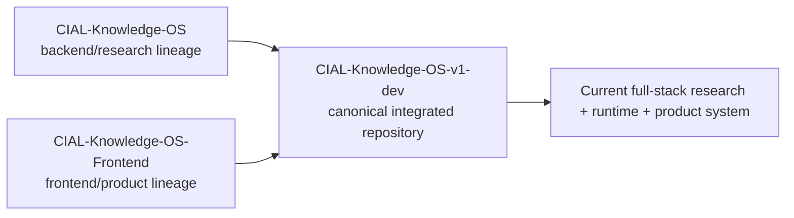

- **Canonical integrated repository:** [adithya-a-labs/CIAL-Knowledge-OS-v1-dev](https://github.com/adithya-a-labs/CIAL-Knowledge-OS-v1-dev)
- **Backend/research lineage:** [adithya-a-labs/CIAL-Knowledge-OS](https://github.com/adithya-a-labs/CIAL-Knowledge-OS)
- **Frontend/product lineage:** [adithya-a-labs/CIAL-Knowledge-OS-Frontend](https://github.com/adithya-a-labs/CIAL-Knowledge-OS-Frontend)
- **Author/maintainer identity present in repository history and benchmark metadata:** Adithya A · [adithya-a-labs](https://github.com/adithya-a-labs)

The integrated repository is the canonical source for current full-stack behavior. Sibling repositories document lineage; their older READMEs or roadmaps should not override the implementation status described here.

---

## Closing perspective

CIAL Knowledge OS is strongest not as a claim that one retrieval recipe “solves” enterprise knowledge, but as a worked systems argument: trustworthy local RAG depends on lifecycle and boundary design. The same source identity must survive file change detection, extraction, chunking, embedding, publication, authorization, retrieval, evidence selection, generation, persistence, citation, preview, and evaluation.

The project’s most reusable lesson is therefore architectural: **make every important state transition explicit, versioned, inspectable, and fail-closed—then qualify quality claims separately from implementation claims.**
